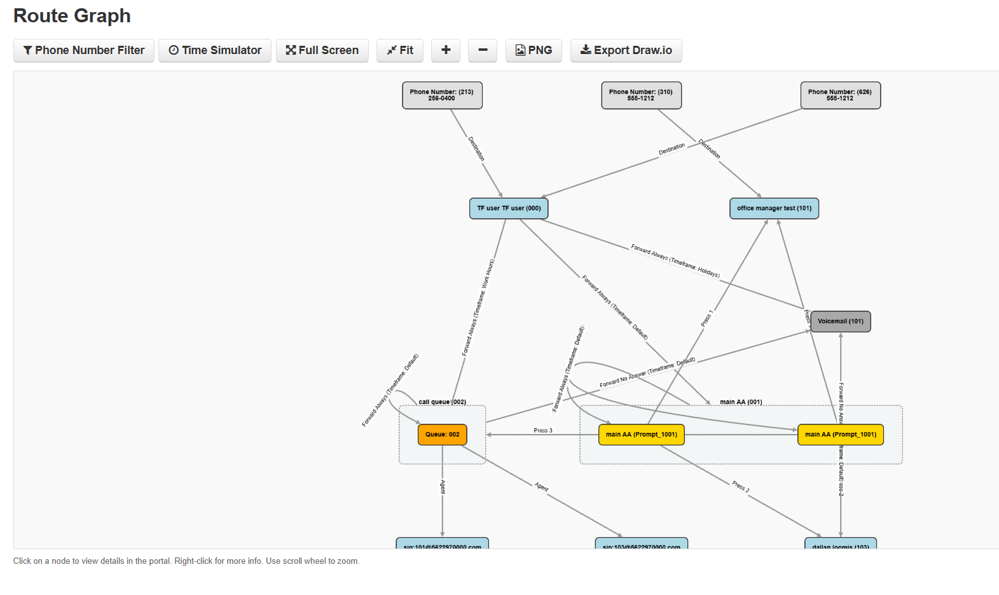
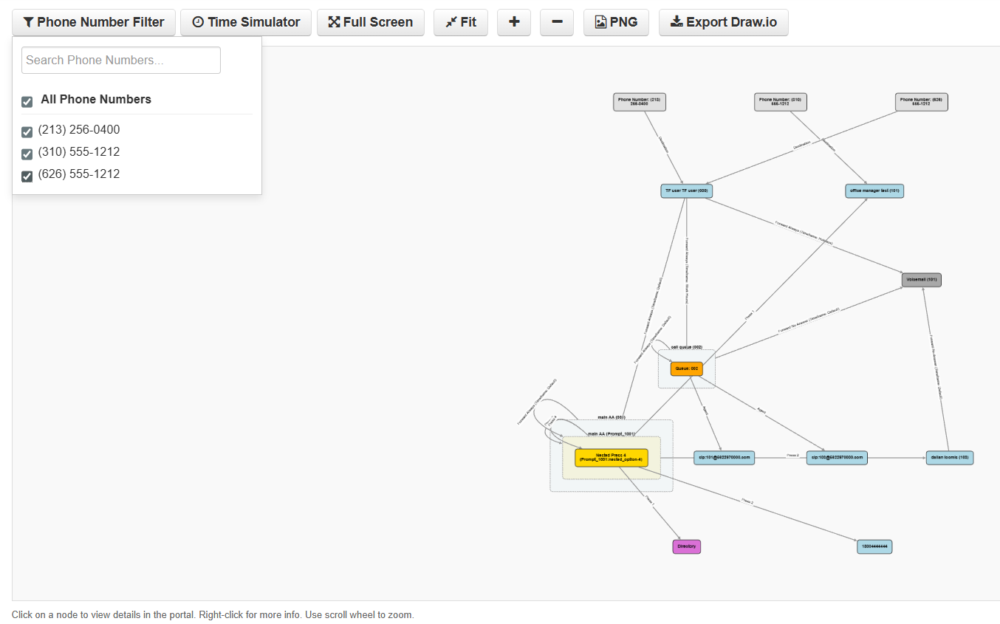
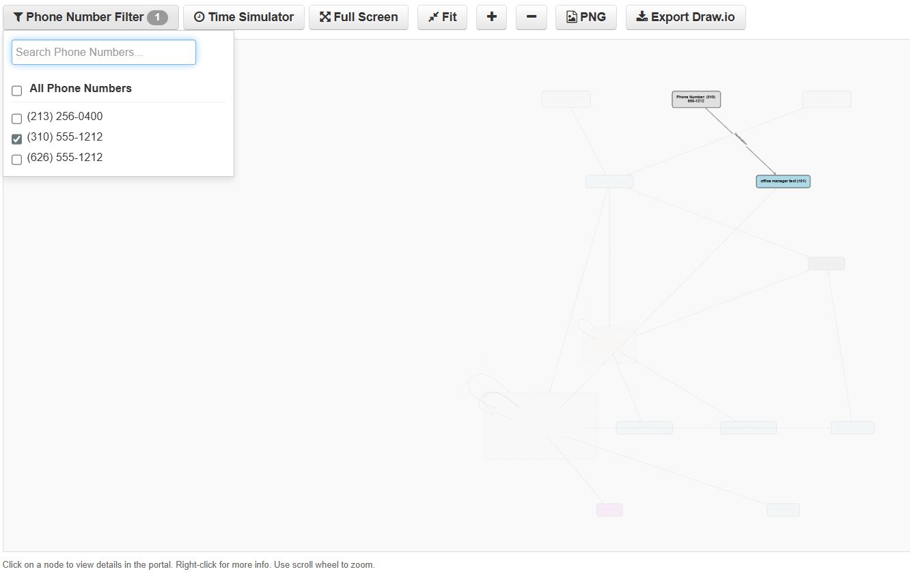
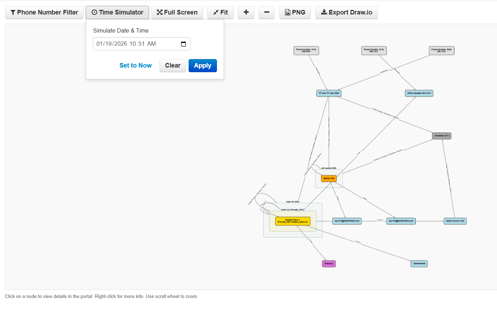
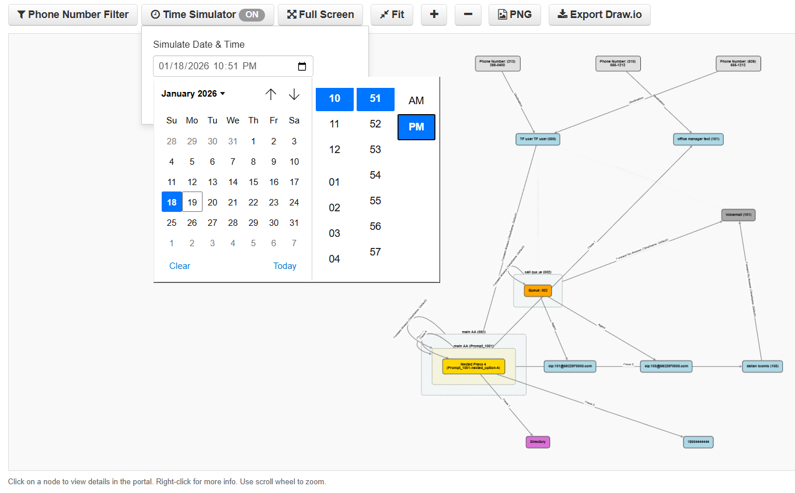
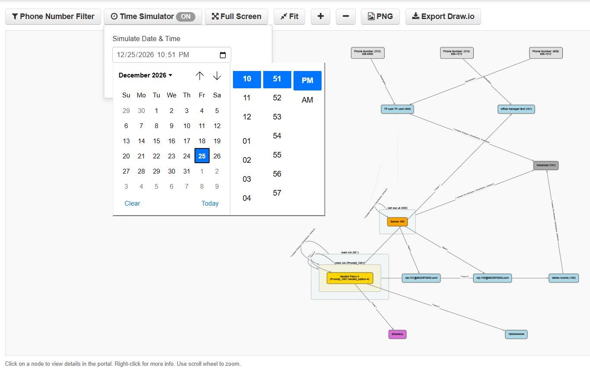
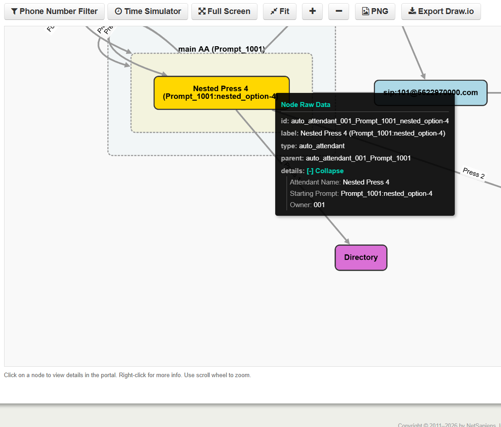
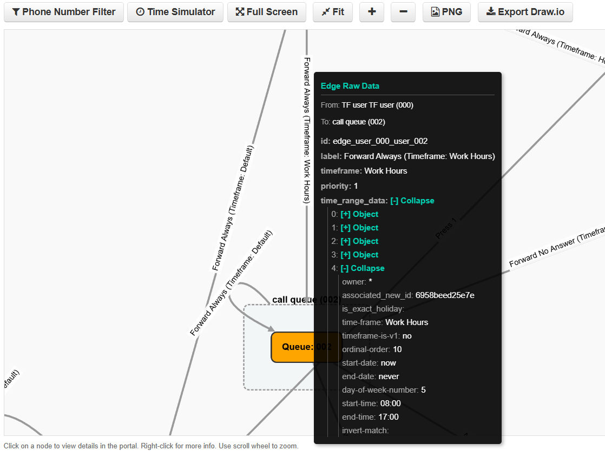

# NetSapiens Call Flow Visualizer

A FastAPI backend service that generates interactive call flow graphs for NetSapiens PBX systems. It acts as a middleware to crawl call logic (DIDs, Users, Auto Attendants, Queues) and produces a directed graph for visualization.

## Features

- **BFS Crawler:** Deep mapping of call flows from Ingress (DID) to endpoints.
- **Resilient Client:** Automatic failover across multiple NetSapiens API clusters.
- **Security:** Strict API URL whitelisting with wildcard support.
- **Frontend Integration:** Serves a dynamic JavaScript module for easy injection into the NetSapiens portal.

## Visual Guide & Usage

### Interactive Graph
The application generates a hierarchical view of your call logic, making it easy to understand complex routing.


### Filtering by Phone Number (DID)
Use the "Phone Number Filter" button to toggle visibility for specific ingress numbers.

*Isolating a specific DID allows you to trace its unique path through the system.*


### Timeframe Simulation
The **Time Simulator** allows you to test how calls route at specific times (e.g., After Hours, Holidays) without waiting.

**Standard Business Hours:**


**Weekend Simulation (Route changes to gray/dashed for inactive paths):**


**Holiday Simulation:**


### Inspecting Details
Right-click on any **Node** (User, Auto Attendant, etc.) or **Edge** (Connection) to view raw API data, configuration parameters, and detailed logic.

**Node Details:**


**Edge Details:**


## Setup

### Prerequisites

- Python 3.11+
- `pip`
- Docker (optional, recommended for production)

### Configuration

The application is configured via environment variables. Create a `.env` file (see `.env.example`) or set these in your container environment.

| Variable | Description | Example |
| :--- | :--- | :--- |
| `PUBLIC_API_URL` | **Required.** The public URL where this API is reachable by the browser. Used to configure the injected JavaScript. | `http://localhost:8000/graph` |
| `ALLOWED_DOMAINS_ENV` | (Optional) Comma-separated list of allowed domains. Merged with `allowed_domains.json`. | `api.netsapiens.com,*.my-pbx.com` |
| `NS_API_TOKEN` | (Development Only) Bearer token for local testing scripts. | `None` |
| `NS_DOMAIN` | (Development Only) Domain for local testing scripts. | `None` |

### Local Development

1. **Clone & Install:**
   ```bash
   git clone <repo_url>
   python -m venv venv
   source venv/bin/activate
   pip install -r requirements.txt
   ```

2. **Run Server:**
   ```bash
   uvicorn main:app --reload
   ```
   The API will be available at `http://localhost:8000`.

## Deployment

### Docker Compose (Recommended)

1.  **Configure Environment:**
    Ensure your `.env` file has the correct `PUBLIC_API_URL` pointing to your production domain (e.g., `https://graph.yourdomain.com/graph`).

2.  **Start Service:**
    ```bash
    docker compose up --build -d
    ```

### Docker Manual Run

```bash
docker build -t route-graph .
docker run -d \
  -p 8000:8000 \
  -e PUBLIC_API_URL="https://graph.yourdomain.com/graph" \
  -v $(pwd)/allowed_domains.json:/app/allowed_domains.json \
  route-graph
```

### Reverse Proxy Configuration

This service is designed to run behind a reverse proxy (Traefik, Nginx, Caddy).
It automatically trusts `X-Forwarded-*` headers from all IPs to ensure correct protocol detection (HTTP vs HTTPS) for generating links.

## Security: API Whitelisting

To prevent SSRF or abuse, the API checks the `api_url` parameter against a whitelist. You can configure this list using either a JSON file (hot-reloadable) or an environment variable. The system merges both lists.

### Option 1: JSON File (Hot-Reloadable)
-   **File:** `allowed_domains.json`
-   **Behavior:** Updates take effect immediately without restarting the server.
-   **Format:**
    ```json
    {
      "allowed_domains": [
        "api.netsapiens.com",
        "*.trusted-pbx.com"
      ]
    }
    ```

### Option 2: Environment Variable
-   **Variable:** `ALLOWED_DOMAINS_ENV`
-   **Format:** Comma-separated list (supports wildcards).
-   **Example:** `ALLOWED_DOMAINS_ENV=api.netsapiens.com,*.my-pbx.com`

## Frontend Integration

The backend serves a pre-configured JavaScript module that injects the visualizer into the NetSapiens inventory tab.

1.  **Locate Script URL:**
    Your script is served at: `https://<your-service-domain>/static/route_graph_inventory_tab.js`

2.  **Configure NetSapiens:**
    In the NetSapiens portal settings (or via API), add this URL to the **`PORTAL_EXTRA_JS`** configuration value.

    *Note: The script is dynamically generated to use the `PUBLIC_API_URL` you defined, ensuring the frontend always knows where to send graph requests.*
    If you already have a javascript injection file, you can add the following to the top of your JS file to load the extra .js file needed:
    
    ```javascript
    // Load bundleRouter.bundle.js asynchronously
    (function() {
    // Create and append the bundleRouter script
    const bundleRouterScript = document.createElement('script');
    bundleRouterScript.src = 'https://<your-service-domain>/static/route_graph_inventory_tab.js';
    
    // Set async to true to load it asynchronously without blocking
    bundleRouterScript.async = true;
    
    // Append to head to ensure it loads as soon as possible
    document.head.appendChild(bundleRouterScript);
    })();
    ```
    
3. **Set Portal UI configs (v44+):**
   Set `PORTAL_CSP_CONNECT_ADDITIONS` with `https://<your-service-domain>.com` for the server where the script is located.
   If you are loading the script inside an existing JS injection, you must add the following for `PORTAL_CSP_SCRIPT_ADDITIONS`:     
   `https://<your-service-domain> https://cdnjs.cloudflare.com/ajax/libs/cytoscape/3.28.1/cytoscape.min.js`  
   OR, if specifying the script directly via `PORTAL_EXTRA_JS` just add  
   `https://cdnjs.cloudflare.com/ajax/libs/cytoscape/3.28.1/cytoscape.min.js`

## Debugging

If the "Route Graph" tab does not appear or behaves unexpectedly:

1.  Open Browser Developer Tools (F12) -> Console.
2.  Enable debug mode:
    ```javascript
    localStorage.setItem("ROUTE_GRAPH_DEBUG", "true");
    ```
3.  Reload the page. Verbose logs will appear in the console.
